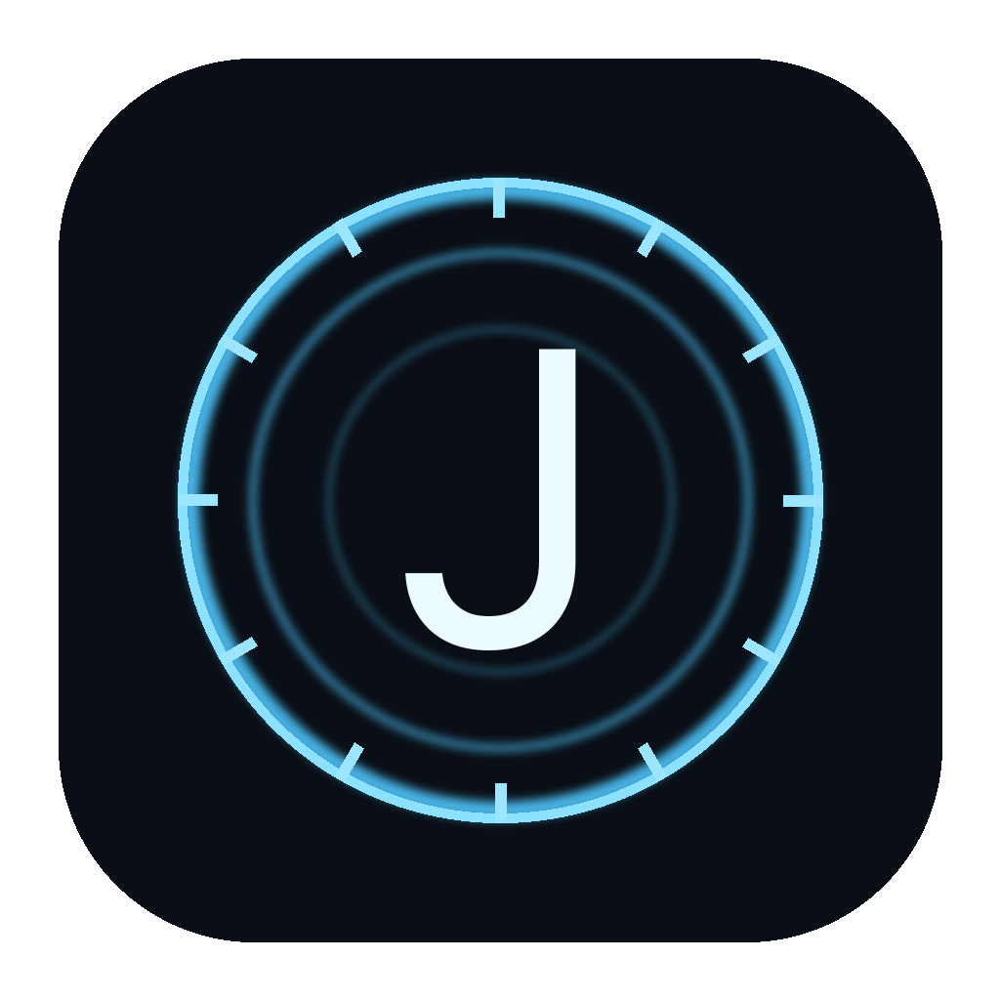

# Jarvis

<p align="center">
  
</p>

<p align="center">
  <strong>Voice meta-controller for your AI agent apps on macOS.</strong><br/>
  Talk to Jarvis. It briefs Codex or Claude, sends the prompt into their app window, and narrates progress back to you.
</p>

---

> **Warning:** Jarvis uses macOS Accessibility to type into and click other applications on your behalf. Only use it on systems and accounts you control. By using this project you accept those risks; the maintainers assume no responsibility or liability for loss, damage, misuse, data exposure, or other consequences.

## What is Jarvis?

Jarvis is a native macOS app you control with your voice. Instead of operating the computer itself, it delegates all real work to local AI agent apps — **Codex** (default) and **Claude** — through their own graphical interfaces:

1. You speak a request ("dile a Claude que revise el reporte…").
2. Jarvis composes a clean, natural prompt in your language.
3. It activates the agent app, opens a **new chat**, pastes the prompt into the chat box, verifies it landed through Accessibility, and presses Enter.
4. An automatic monitor polls the agent every 30 seconds and tells you out loud when it finishes, gets blocked, or needs your approval.

It can also open the files your agents produce (PDF, Word, PowerPoint, Markdown…) and click visible buttons by label when you ask.

## Features

- **Voice-first** — realtime speech via OpenAI Realtime (deep natural male voice), Spanish by default, English supported
- **GUI delegation with verification** — prompts are pasted into the agent's real chat box; delivery is verified through Accessibility, with honest status reporting when it can't be confirmed
- **New chat per task** — delegations never interrupt a conversation the agent already has in flight
- **Proactive monitoring** — Jarvis narrates completion, blockers, and approval requests without being asked
- **Light desktop actions** — open files by name (Spotlight search, newest match), paste text into any app, click buttons by their visible label
- **Durable memory** — local SQLite-backed memory store with policy gating and approval support
- **All local** — a Swift app plus a Node sidecar bound to `127.0.0.1`, secured with a per-session bearer token

## Architecture

| Component | Role |
|---|---|
| Swift app (`Sources/JarveyNative`) | Menu-bar app, control window, onboarding, and an input-action server (`127.0.0.1:4819`) that drives other apps via CGEvent + Accessibility |
| Node sidecar (`src/sidecar`) | Local API (`127.0.0.1:4818`): delegation bridge, agent status, file opening, settings, memory |
| Voice runtime (`src/voice`) | Runs in a hidden `WKWebView` using `@openai/agents-realtime`; defines the voice persona and tools |

## Requirements

| Requirement | Details |
|---|---|
| **OS** | macOS 14 (Sonoma) or newer |
| **API key** | OpenAI **platform API key** (required — see below) |
| **Permissions** | Microphone, Accessibility, file access (Documents); Screen Recording optional |
| **Agent apps** | Codex and/or Claude installed in `/Applications` |

> **Note — API key only:** Jarvis is built on the OpenAI **Realtime API** (`gpt-realtime` models), which is only available through the OpenAI Platform with an API key and pay-per-use billing. A ChatGPT subscription (Plus/Pro/Business) or "Sign in with ChatGPT" OAuth **cannot** power the voice layer — OAuth tokens are scoped to Codex and do not work against the Realtime API. Your subscriptions still matter: the Codex and Claude apps that Jarvis delegates work to run on their own accounts; the API key only pays for Jarvis's voice.

For building from source you also need:

- Node.js 22 (better-sqlite3 is ABI-sensitive; the packaging script verifies the embedded runtime)
- Swift 6 / Xcode Command Line Tools

## Build & Run

```bash
npm install
npm run build:sidecar
npm run build:voice
swift build
./scripts/package-native-app.sh   # produces dist-native/Jarvis.app
open dist-native/Jarvis.app
```

Set `SIGN_IDENTITY` to your own signing identity — a stable identity keeps macOS TCC permissions across rebuilds. On first launch, onboarding walks you through the API key and each macOS permission.

The API key is stored at `~/Library/Application Support/Jarvis/secrets/openai.env` with mode 600 and is never logged.

## Validation

```bash
npm run ci            # typecheck, unit tests, Swift tests, builds, public-repo scan
npm run check:public  # just the public-release safety scan
```

## Privacy

**Sent to OpenAI:** user requests, transcript context, and voice/audio data required for model interaction.

**Stored locally on disk:** settings, runtime logs, and durable memory records.

Jarvis does not include analytics or third-party telemetry.

## Security notes

- Both local servers bind to loopback only and require a per-session bearer token generated at launch.
- Sensitive prompts (credentials, payments, destructive commands) are blocked from automatic delivery and require manual handling.
- An emergency Stop All pauses every input action.

See [SECURITY.md](SECURITY.md) for vulnerability reporting guidelines.

## Contributing

See [CONTRIBUTING.md](CONTRIBUTING.md) and [CODE_OF_CONDUCT.md](CODE_OF_CONDUCT.md).

## License

[MIT](LICENSE)
